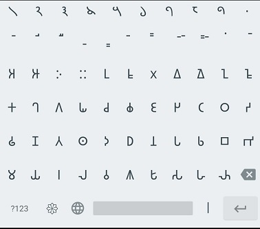
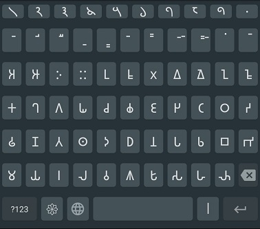

## Brahmi Keyboard
This project is an Android Input Method (Keyboard) for the Brahmi Script, to be used on modern Android devices capable of rendering Brahmi Unicode.  
At the time of writing, this is the only Android Keyboard to enable writing in the Brahmi Script.

#### About Brahmi -
The Brahmi Script is the parent script of all Indic scripts and the extended Brahmic Family. It is the oldest alphasyllabary in the world, with the oldest verified inscriptions going back 2500 years BP. One of its famed descendants include Devanāgarī. It is pronounced as: <i>braa-h-mee</i>, and also alternatively spelled as Bramhi (IAST: Brāhmī).

#### Brahmi Specifications -

 Unicode Block : U+11000 - U+1107F  
ISO 15924 : Brah, 300  
ISO 15924 Script Code : BRAHMI 

 

### Features
- Brahmi Input
- Optional Bramhi Number row
- Input switching key to shift to primary keyboard (if active)
- Additional characters on longpress for specific keys
- Resource light and tiny in size (<1MB)
- Adjustable keyboard height for more screen space
- Swipe space to move pointer
- Delete swipe
- Custom theme colors
- Permissions required: Vibrate
- Ad-free

### Upcoming Features
- Second Page (symbols page) for all numeric characters
- Keys layout optimisations
- Removing redundant options in Keyboard Settings
- Removing redundant code
- APK for direct installation (API 30 and lower)
- Publishing to stores

## Credits

Licensed under Apache License Version 2

This keyboard is based on rkkr's [Simple Keyboard](https://github.com/rkkr/simple-keyboard), which in turn is based on AOSP LatineIME Keyboard ([source code](https://android.googlesource.com/platform/packages/inputmethods/LatinIME)).
